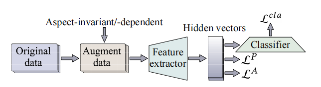

# Enhancing Aspect-Based Sentiment Analysis with Supervised Contrastive Learning.

This repo contains the PyTorch implementaion for the paper *Enhancing Aspect-Based Sentiment Analysis with Supervised Contrastive Learning*.

[**Enhancing Aspect-Based Sentiment Analysis with Supervised Contrastive Learning**](https://dl.acm.org/doi/pdf/10.1145/3459637.3482096) 
<br>
Bin Liang<sup>#</sup>, Wangda Luo<sup>#</sup>, Xiang Li, Lin Gui, Min Yang, Xiaoqi Yu, and Ruifeng Xu<sup>*</sup>. *Proceedings of CIKM 2020*
  
Please cite our paper and kindly give a star for this repository if you use this code. 

For any questions about the implementation, plaese email luowangda_hitsz@163.com or bin.liang@stu.hit.edu.cn.

### Model Overview


### Requirement

* pytorch >= 0.4.0
* numpy >= 1.13.3
* sklearn
* python 3.6 / 3.7
* CUDA 9.0
* [transformers](https://github.com/huggingface/transformers)

To install requirements, run `pip install -r requirements.txt`.  

### Dataset

you can directly use the processed dataset located in `datasets/`:  
Note that you need to extract the data from the datasets folder: `unzip datasets.zip`
```
├── data
│   │   ├── semeval14(res14，laptop14)
│   │   ├── semeval15(res15)
│   │   ├── semeval16(res16)
│   │   ├── MAMS
```

The dataSet contains with cl_2X3 is the dataSet obtained after label argment, and each data is as follows:  
Context  
Aspect  
Aspect-sentiment-label(-1:negative;0:netrual;1:positive)  
Contrastive-label(aspect-dependent/aspect-invariant)  
Contrastive-aspect-label(0:negative;1:netrual;2:positive)  

### Preparation
a) Download the pytorch version pre-trained bert-base-uncased model and vocabulary from the link provided by huggingface. Then change the value of parameter --bert_model_dir to the directory of the bert model.
you can get the pre-trained bert-base-uncased model in https://github.com/huggingface/transformers.

b) Label enhancement method. For new data, additional supervised signals need to be obtained through label enhancement;  
&nbsp;&nbsp;&nbsp;&nbsp;i) Through BERT overfitting the training set, the acc can reach more than 97%;  
&nbsp;&nbsp;&nbsp;&nbsp;ii) Replace aspect with other or mask, and get the emotional label of the aspect after replacing the aspect;  
&nbsp;&nbsp;&nbsp;&nbsp;iii) Determine whether the output label is consistent with the real label, and fill in the aspect-dependent/aspect-invariant label for the data.  

c) The data defaults are in data_utils.py, which you can view if you want to change the data entered into the model.

### Training

1. Adjust the parameters and set the experiment.  
    --model:Selection model.(bert_spc_cl)  
    --dataset:Select dataSet.(acl14,res14,laptop14,res15,res16,mams and so on)  
    --num_epoch：Iterations of the model.  
    --is_test 0:Verify module.(1 is data verification, 0 is model training)  
    --type: Select a task type.(normal,cl2,cl6,cl2X3)  
2. Run the shell script to start the program.

```sh
bash run.sh
```
For run.sh code:
```angular2

CUDA_VISIBLE_DEVICES=3 \
  python train_cl.py \
  --model_name bert_spc_cl \
  --dataset cl_mams_2X3 \
  --num_epoch 50 \
  --is_test 0 \
  --type cl2X3

```
For dataset,you can choose these dataset : "cl_acl2014_2X3" "cl_res2014_2X3" "cl_laptop2014_2X3" "cl_res2015_2X3" "cl_res2016_2X3" "cl_mams_2X3".
### Testing
```sh
bash run_test.sh
```


### Citation
```
@inproceedings{10.1145/3459637.3482096,
author = {Liang, Bin and Luo, Wangda and Li, Xiang and Gui, Lin and Yang, Min and Yu, Xiaoqi and Xu, Ruifeng},
title = {Enhancing Aspect-Based Sentiment Analysis with Supervised Contrastive Learning},
year = {2021},
isbn = {9781450384469},
publisher = {Association for Computing Machinery},
address = {New York, NY, USA},
url = {https://doi.org/10.1145/3459637.3482096},
doi = {10.1145/3459637.3482096},
```

### Credits
The code of this repository partly relies on [ABSA-PyTorch](https://github.com/songyouwei/ABSA-PyTorch).
I would like to express my gratitude to the authors of the [ABSA-PyTorch](https://github.com/songyouwei/ABSA-PyTorch) repository.
